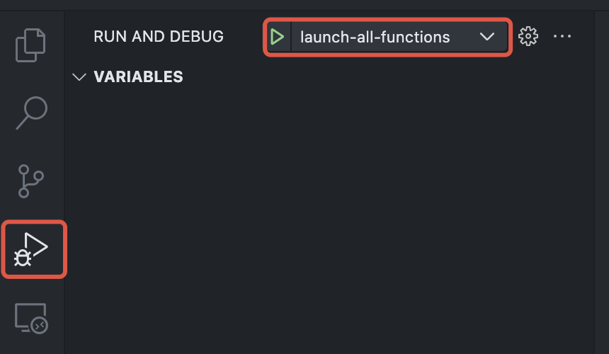
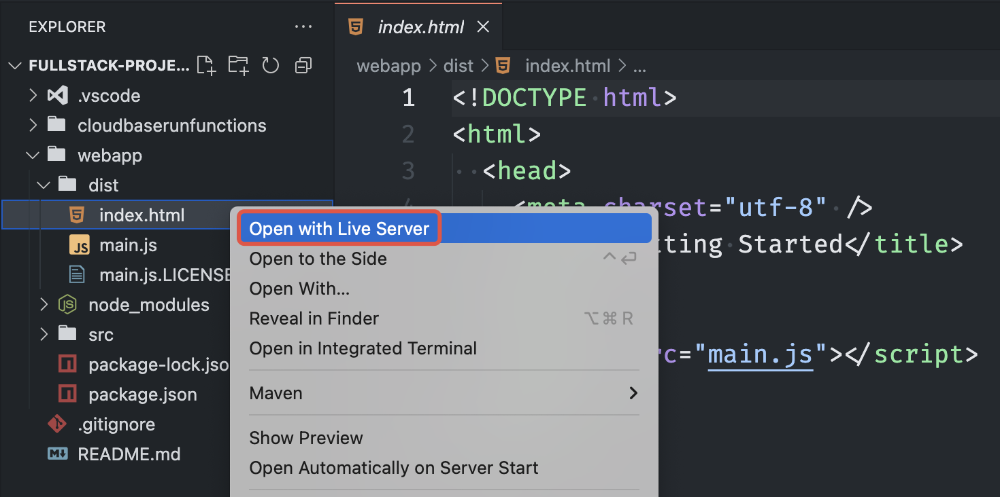

# 基于云函数2.0的全栈项目

本示例项目为云函数2.0的全栈项目示例，包括前端和云函数部分。是文档 [本地开发云函数](https://docs.cloudbase.net/cbrf/how-to-develop-local) 的一个示例项目。

本示例项目主要演示如何在本地开发环境中开发调试云函数，以及如何将前端请求转发到本地运行的云函数、本地云函数如何调用本地云函数等。

## 目录说明

```sh
$ tree -L 3
.
├── README.md # 本文档
├── .vscode # VSCode 配置目录，包括调试配置
├── cloudbaserunfunctions # 项目后端云函数目录，包含多个函数
│   ├── call-other-fn     # 函数：call-other-fn
│   │   └── index.js
│   ├── echo              # 函数：echo
│   │   └── index.js
│   └── helloworld        # 函数：helloworld
│       └── index.js
└── webapp # 项目前端相关代码目录
    ├── package.json 
    ├── dist  # 项目前端构建目录
    │   ├── index.html
    │   ├── main.js
    │   └── main.js.LICENSE.txt
    └── src   # 项目前端源文件
        └── index.js

8 directories, 10 files
```

## 前置准备

修改 `webapp/src/index.js` 中的 `env` 和 `clientId` 真实的值。

```ts
const tcbapp = cloudbase.init({
  env: 'your-env-id',
  clientId: 'your-client-id'
})
```

## 项目启动

### 启动云函数部分

因 函数 `cloudbaserunfunctions/call-other-fn` 依赖第三方模块，所以需要在该函数目录下安装依赖。

进入 `cloudbaserunfunctions/call-other-fn` 函数目录下安装依赖：

```sh
cd cloudbaserunfunctions/call-other-fn
npm install
```

其他函数因未依赖任何第三方模块，所以不需要安装依赖。

在当前目录下启动所有函数：

```sh
NODE_TLS_REJECT_UNAUTHORIZED=0 tcb-ff --loadAllFunctions=true --functionsRoot=cloudbaserunfunctions --enableCors=true
```

* `NODE_TLS_REJECT_UNAUTHORIZED=0` 是为了避免本地调试时出现证书问题

该示例代码中包括 `vscode` 的调试配置，也可以直接在 `vscode` 中启动调试。

将 `vscode` 切到调试界面，然后选择 `launch-all-functions`，点击启动即可。



启动断点调试：


### 启动前端部分

安装依赖并编译源代码：

```sh
cd webapp
npm install
npx webpack -w
```

编译之后，通过 `vscode` 插件 `Live Server` 打开 `webapp/dist/index.html` 即可看到前端页面。



该前端页面没有展示任何内容，需要打开浏览器 `DevTools` 查看 `Network` 或 `Console`。

### 将前端请求转发到本地运行的云函数

默认情况下，前端请求的是部署在云端的云函数，如果需要将请求转发到本地运行的云函数，需要使用代理工具，比如 `whistle`。

如何配置 `whistle` 请参考：<https://docs.cloudbase.net/cbrf/how-to-develop-local#搭建-本地代理层-服务>
