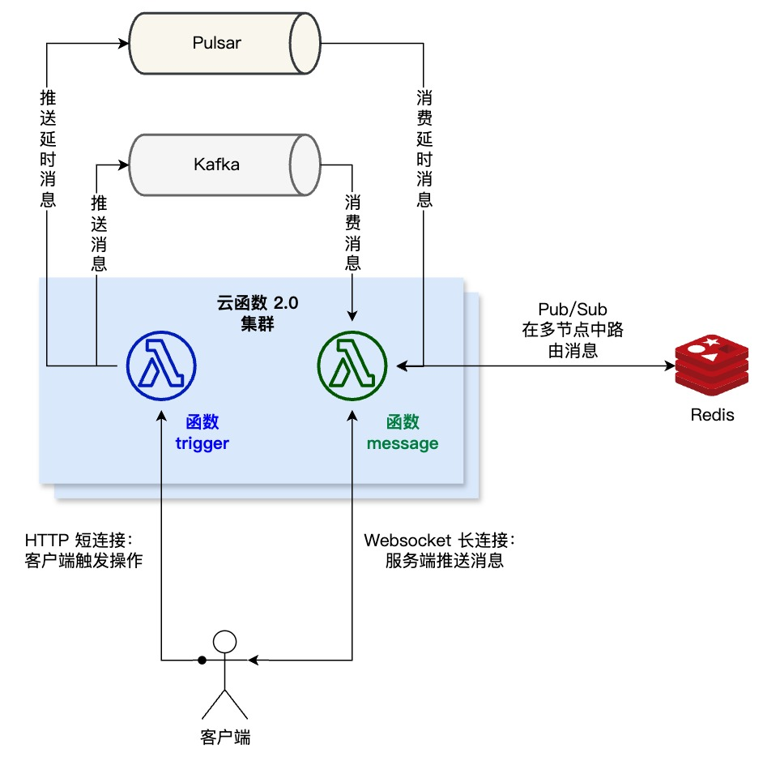

# 云函数2.0示例项目-消息中心

云函数2.0 基于 消息队列Kafka 和 Redis 实现与客户端收发消息的示例。

## 架构示意图



## 时序图

```mermaid
sequenceDiagram
    autonumber
    actor c as 客户端
    box rgb(199,239,251) 云函数2.0 服务集群
    participant t as 函数 trigger
    participant m as 函数 message
    end
    participant k as Kafka
    participant r as Redis


    m --> k: 消费消息（异步）
    c ->> +m: 建立 Websocket 连接
    note over m: 订阅客户端 channel，异步完成
    m --> r: 订阅 Redis channel（异步）

    c ->> +t: HTTP 请求触发函数，执行操作
    t -->> -c: 返回（同步）
    t ->> k: 投递消息

    note over k: Kafka 投递消息完成后，函数 message 进行消费
    m --> r: 收到消息后，发布到客户端 channel（异步）
    m -->> c: 推送消息到指定客户端（异步）

```

## 使用

1. 前置条件

- 安装 `Node.js`
- 安装 `pnpm`
- 安装 `@cloudbase/functions-framework`

2. 进入项目根目录，安装依赖，构建代码

```sh
pnpm i

pnpm run build
```

3. 在项目根目录创建 `.env` 文件，填入中间件参数

```sh
touch .env
```

`.env` 文件内容：

```env
KAFKA_BROKER=ip:port        # Kafka 连接地址
KAFKA_TOPIC=topic-xxx       # Kafka 主题名
REDIS_URL=redis://ip:port   # Redis 连接地址
```

4. 启动服务

```sh
pnpm start
```

5. 客户端向 `message` 函数发起 websocket 长链接

```sh
# User-Agent、客户端 IP 用于关联客户端
wscat -c "ws://127.0.0.1:3000/message" -H "User-Agent:unique-client"
```

6. 客户端向 `trigger` 函数发送消息

```sh
# User-Agent、客户端 IP 用于关联客户端
curl -v http://127.0.0.1:3000/trigger \
    -H "content-type:application/json" \
    -H "User-Agent:unique-client" \
    -d '{"id":"Hello"}'
```

7. 连接到 `message` 函数的客户端收到服务端推送的消息，消息内容为客户端向 `trigger` 函数发送的消息

```text
< {"id":"Hello"}
```

8. 使用 `pm2` 扩展为多节点部署

    8.1 全局安装 `pm2`

    ```sh
    npm i -g pm2
    ```

    8.2 使用 pm2 启动项目

    ```sh
    pm2 start ecosystem.config.js
    ```
