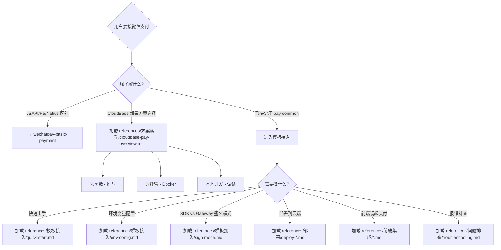

# CloudBase 微信支付接入指南（pay-common 模板）

基于 `pay-common` Express 模板的 **CloudBase 平台微信支付全流程指引**——
从选型、配置、部署、前端集成到问题排查。

---

## 全局规范

1. **确认部署方式**：任何能力使用前须先确认——HTTP 云函数 / 云托管 / 本地开发
2. **确认支付方式**：仅下单和前端集成需要确认（JSAPI/H5/Native）
3. **API 问题引流**：涉及签名算法、API 错误码、退款规则 → 推荐 `wechatpay-basic-payment`
4. **Demo 优先**：回答前端集成问题时，优先引用以下 Demo：
   - 小程序：[GitHub 官方示例](https://github.com/TencentCloudBase/awesome-cloudbase-examples/tree/master/integration/cloudbase-wx-pay/examples/miniprogram)
   - Web 测试页：本地 `examples/react/`（React + Vite）
   - 各支付方式代码示例见 `pay-common/README.md` §Step 5
5. **脚本优先**：排查配置问题时，优先使用 `scripts/` 下的诊断脚本
6. **安全优先**：私钥、证书等敏感信息必须用环境变量注入，禁止硬编码

## 关联技能

| 技能 | 负责范围 |
|------|---------|
| `wechatpay-basic-payment` | 微信支付 API 层面（签名算法、错误码、退款规则、Java/Go 示例） |
| `wechatpay-product-coupon` | 商品券接入专项 |

本 Skill **专注范围**：CloudBase 平台上使用 `pay-common` 模板的部署、配置、集成、排障。

---

## 快速决策树



---

## 能力路由表

| # | 能力 | 触发关键词 | 加载文档 |
|---|------|-----------|---------|
| 1 | **方案选型** | 支付方案怎么选 / pay-common 和云调用区别 / CloudBase 部署方案 | `references/方案选型/cloudbase-pay-overview.md` |
| 2 | **模板接入** | 怎么用 pay-common / 环境变量怎么配 / SDK Gateway 区别 / cloudbaserc.json 配置 | `references/模板接入/{quick-start,env-config,sign-mode}.md` |
| 3 | **部署** | 怎么部署到云函数 / 用云托管 / 本地调试 / HTTP 访问服务配置 / 环境变量同步 | `references/部署/deploy-{cloud-function,cloud-run,local}.md` |
| 4 | **前端集成** | 小程序怎么调起支付 / H5 怎么接 / PC 扫码 / React Web 测试页 | `references/前端集成/{miniprogram-*,web-*}.md` |
| 5 | **问题排查** | 签名失败 / 回调收不到 / 部署后 502 / 转账报错 | `references/问题排查/{troubleshooting,error-patterns}.md` |

> **部署关键步骤速查**（新手必看）：
> - **cloudbaserc.json 完整示例 + type:HTTP 字段说明** → `quick-start.md` Step 4.1
> - **HTTP 访问服务开启 + 路由配置（控制台/CLI）** → `quick-start.md` Step 4.2
> - **回调 URL 组装公式 + 真实范例** → `quick-start.md` Step 4.3
> - **环境变量同步到线上（控制台操作路径）** → `quick-start.md` Step 4.4

每次只加载用户当前场景需要的 **1-2 篇**参考文档，不要全部加载。

---

## API 路由速查表

> 基于 `pay-common/README.md` §路由表。下单/查询/退款/转账路由前缀为 `/wxpay_*`，回调路由为 `/*Trigger`。

### 下单路由

| 路由 | 方法 | 说明 | 必传字段 |
|------|------|------|---------|
| `/wxpay_order` | POST | JSAPI/小程序下单 | description, out_trade_no, amount.total(CNY分), payer.openid |
| `/wxpay_order_h5` | POST | H5 下单 | 同上 + scene_info(payer_client_ip, h5_info) |
| `/wxpay_order_native` | POST | Native 扫码下单 | 同上 + scene_info(payer_client_ip)，无需 openid |

### 查询路由

| 路由 | 方法 | 说明 |
|------|------|------|
| `/wxpay_query_order_by_out_trade_no` | POST | 商户订单号查单 |
| `/wxpay_query_order_by_transaction_id` | POST | 微信订单号查单 |
| `/wxpay_close_order` | POST | 关闭订单 |

### 退款路由

| 路由 | 方法 | 说明 | 注意事项 |
|------|------|------|---------|
| `/wxpay_refund` | POST | 申请退款 | 同一订单最多 50 次部分退款；重试必须复用 out_refund_no |
| `/wxpay_refund_query` | POST | 查询退款 | - |

### 商家转账路由（升级版-单笔模式）

| 路由 | 方法 | 说明 | 注意事项 |
|------|------|------|---------|
| `/wxpay_transfer` | POST | 发起商家转账 | 0.3 元 ≤ 金额 < 2000 元；不填 user_name；ACCEPTED ≠ 成功 |
| `/wxpay_transfer_bill_query` | POST | 商户单号查转账 | - |
| `/wxpay_transfer_bill_query_by_no` | POST | 微信单号查转账 | - |

### 回调路由（无鉴权）

| 路由 | 方法 | 说明 |
|------|------|------|
| `/unifiedOrderTrigger` | POST | 支付回调通知（SDK 模式） |
| `/refundTrigger` | POST | 退款回调通知（SDK 模式） |
| `/transferTrigger` | POST | 转账回调通知（SDK 模式） |

> **⚠️ SDK 验签模式的硬性约束（5 条）**：
>
> | # | 约束 | 违反后果 |
> |---|------|---------|
> | 1 | **回调必须走 HTTP 访问服务，不能走云 API 网关** | 微信服务器直连你的服务；云 API 网关会加鉴权层/篡改请求格式导致验签失败 |
> | 2 | **HTTP 访问服务的回调路由不能开启身份认证** | 微信服务器回调不带任何 Token，开了身份认证会被 401/403 拦截 |
> | 3 | **回调 URL 必须带完整路径（含路由 Path）** | 域名后带自定义路径前缀（如 `/pay/wx-pay/`），漏写则回调 404 |
> | 4 | **必须在商户平台设置 APIv3 密钥** | **未设置 = 收不到任何回调通知！**（支付结果、退款、转账全部丢失） |
> | 5 | **回调处理必须在 5 秒内返回应答** | 超时触发重试（最多约 15 次 / 最长 24h），可能导致重复扣款或发货 |
>
> **简单总结：SDK 模式 = 开 HTTP 访问服务 → 关掉回调路由身份认证 → 设 APIv3 密钥 → 回调 URL 写完整 → 5 秒内返回**
>
> **详细操作步骤见 `references/模板接入/quick-start.md` Step 4.2-4.5**
>
> 对比 **Gateway 模式**：回调地址由集成中心自动生成（在 CloudBase 控制台 → 微信支付 → 集成中心配置后获得），直接复制填入即可，无需处理 path 问题，也无特殊部署约束。

### 请求/响应格式

```json
// 成功请求示例（JSAPI）
{"description": "商品名称", "out_trade_no": "ORDER20260424001", "amount": {"total": 100, "currency": "CNY"}, "payer": {"openid": "oUpF8xxx"}}

// 成功响应
{"code": 0, "msg": "success", "data": {"prepay_id": "wx201410272009395522657a690389285100"}}

// 失败响应
{"code": -1, "msg": "amount.total 必须为正整数（单位：分）", "data": null}

// 回调应答（必须 5 秒内返回）
{"code": "SUCCESS", "message": "成功"}
```

---

## 安全红线速查

以下规则来自 `pay-common/README.md` 的铁律和注意事项：

| # | 规则 | 违反后果 | 来源 |
|---|------|---------|------|
| 1 | **金额单位 = 分** | `amount.total` 传入元为单位或浮点数会导致金额错误 | README 铁律 |
| 2 | **订单号全局唯一** | `out_trade_no` 重复导致"订单号重复"错误；`out_refund_no` 重试换新号 = 多退钱 | README 铁律 |
| 3 | **下单与调起使用同一私钥** | 混用不同证书/私钥导致调起支付签名失败 | README 铁律 |
| 4 | **回调先应答后处理** | 超时 5 秒未返回导致微信重试（最多约 15 次 / 最长约 24 小时）。正确模式：收到回调 → 立即返回 200 → 异步执行业务逻辑。详见 `quick-start.md` Step 4.5 |
| 5 | **回调必须幂等** | 不做幂等检查会重复发货/重复扣款 | 开发注意事项 §2.4 + README |
| 6 | **openid 不可信** | 前端传入的 openid 可被篡改，生产环境用服务端 JWT 获取 | 开发注意事项 §六 |
| 7 | **APIv3 密钥不可缺** | 未在商户平台设置 = 收不到任何回调（支付结果/退款/转账通知全部丢失） | 微信支付官方规范 + `quick-start.md` Step 2 |

---

## 环境变量速查表

> 完整配置说明见 `references/模板接入/env-config.md`。

| 变量 | SDK 模式 | Gateway 模式 | 说明 |
|------|---------|-------------|------|
| `signMode` | `sdk` | `gateway` | 签名模式切换 |
| `appId` | 必填 | 必填 | 小程序/公众号 AppID |
| `merchantId` | 必填 | 必填 | 商户号（10 位数字） |
| `merchantSerialNumber` | 必填 | 必填 | API 证书序列号 |
| `apiV3Key` | 必填 | 必填 | APIv3 密钥（32 字节） |
| `privateKey` | 必填 | 必填 | 商户 API 私钥（PEM，换行用 `\n`） |
| `wxPayPublicKey` | 必填 | 必填 | 微信支付公钥（非商户公钥！） |
| `wxPayPublicKeyId` | 必填 | 必填 | 微信支付公钥 ID |
| `notifyURLPayURL` | 自己的域名（含完整 path） | **集成中心自动生成**，直接复制填入 | 支付回调地址 |
| `notifyURLRefundsURL` | 自己的域名（含完整 path） | **集成中心自动生成**，直接复制填入 | 退款回调地址 |
| `transferNotifyUrl` | 自己的域名（含完整 path） | **集成中心自动生成**，直接复制填入 | 转账回调地址 |
| `corsAllowOrigin` | 选填 | 选填 | CORS 允许来源（多域逗号分隔） |

> **关键差异**：
> - **凭证完全相同**：两种模式需要相同的私钥/公钥/证书等，区别仅在于 **回调 URL 和部署要求**
> - **SDK 模式**：回调指向自己的服务（HTTP 访问服务域名，**必须包含路由 Path**）；回调路由不能开身份认证；**回调不能走云 API 网关**
>   - URL 组装公式：`{HTTP访问服务域名}/{路由Path}/{API路径}`
>   - 真实示例：`https://test-wxpay-xxx.ap-shanghai.app.tcloudbase.com/pay/wx-pay/unifiedOrderTrigger`
>   - 详见 `quick-start.md` Step 4.2-4.3
> - **Gateway 模式**：回调地址指向集成中心，由控制台自动生成，**直接复制填入即可**；无特殊部署约束；前端可走云 API 网关

---

## Demo 索引表

| Demo | 来源 | 调用方式 | 适用部署 | 说明 |
|------|------|---------|---------|------|
| **小程序** | [GitHub 官方](https://github.com/TencentCloudBase/awesome-cloudbase-examples/tree/master/integration/cloudbase-wx-pay/examples/miniprogram) | `signInWithOpenId()` + Bearer Token（云 API 网关） | HTTP 云函数 | **官方示例**，支持下单/查单/关单/退款/转账 |
| **React Web** | 本地 `examples/react/` | React + Vite，HTTP 访问服务直连（无鉴权） | 静态托管 + HTTP 访问服务 | Web 测试页，JSAPI/H5/Native 三合一 |

> 小程序 Demo 前置条件：
> 1. 已开通 CloudBase 环境 + 开启微信小程序身份源
> 2. 已将 pay-common 部署为 HTTP 云函数
> 3. 已完成商户号进件 + 后端环境变量配置
> 4. 修改 `app.js` 填入 ENV_ID 和 PUBLISHABLE_KEY，`project.config.json` 填入 appid

完整代码示例见各前端集成文档。

---

## 脚本工具

| 脚本 | 功能 | 使用时机 |
|------|------|---------|
| `scripts/validate_env.sh` | 校验 `.env` 配置完整性 | 配置环境变量后、部署前 |
| `scripts/check_pem_format.py` | PEM 私钥格式检查 | 签名失败时排查 |
| `scripts/check_deploy_config.py` | cloudbaserc.json 与 .env 一致性 | 部署前检查 |
| `scripts/test_callback_url.sh` | 回调 URL 连通性测试 | 回调收不到时排查 |

### 脚本调用方式

```bash
# 通过 skill_run 执行（沙箱隔离）
skill_run(skill="cloudbase-wechatpay", command="bash scripts/validate_env.sh /path/to/.env")
skill_run(skill="cloudbase-wechatpay", command="python3 scripts/check_pem_format.py 'PRIVATE_KEY_STRING'")
```

所有脚本遵循：无交互、结构化 JSON 输出（stdout）、退出码 0=正常/1=有问题/2=参数错误、不输出密钥原文。

---

## 重要概念速查

| 概念 | 说明 |
|------|------|
| **AppID 类型对应关系** | JSAPI/H5 → 公众号 AppID；小程序 → 小程序 AppID；Native → 公众号或小程序 AppID |
| **有效期** | `prepay_id` = 2 小时；`h5_url` = 5 分钟；`code_url`(扫码) ≈ 2 小时 |
| **H5 支付授权目录** | 必须在商户平台配置，格式如 `https://domain.com/`，末尾 `/` |
| **H5 场景信息** | `scene_info.payer_client_ip` 必填（风控），`h5_info.type` 必填（如 `Wap`） |
| **转账受理 ≠ 成功** | 受理成功（`ACCEPTED`）仅表示请求被接受，必须查单/等回调确认最终状态 |
| **回调重试机制** | 15s×2 → 30s → 3min → 10min×... → 最长约 24h，共 ~15 次；**必须 5 秒内返回应答** |
| **APIv3 密钥的双重角色** | 不仅用于请求签名，更是接收回调通知的前提条件！未设置 = 所有回调丢失。详见 `quick-start.md` Step 2 注释区 |
| **签名探测请求（SIGNTEST）** | 微信会发送 `WECHATPAY/SIGNTEST/` 前缀的探测请求验证验签能力。收到后返回错误码即可，属正常行为，无需处理。详见 `quick-start.md` Step 4.5 |
| **回调 IP 白名单** | 需在防火墙/安全组放行微信回调 IP 段（上海/深圳/广州腾讯云） |
| **SDK 模式双通道架构** | 小程序 Demo 走两条通道：①前端→云API网关（主动请求，带Token）②微信→HTTP访问服务（回调通知，无鉴权）。两者域名不同、鉴权方式不同，必须分别配置。详见 `quick-start.md` Step 4.0 架构图 |
| **三种调用方式区别** | ①**事件型（普通型）** `callFunction`（SDK 内部通道，自动带 openId，无公网地址，cloudbaserc.json 无 type 字段）②HTTP 云API网关（需 Bearer Token，`?webfn=true`）③HTTP 访问服务（公网域名，无内置鉴权，**唯一可收微信回调的方式**）。详见 `quick-start.md` Step 3.5 |
| **JSAPI 公众号后台配置** | JSAPI 支付需配置 3 个域名：①网页授权域名（OAuth2 redirect_uri 白名单，不能用 IP）②JS接口安全域名（wx.requestPayment 校验）③支付授权目录（商户平台）。三者缺一不可 |
| **匿名登录不能用于支付** | 匿名登录没有 openid，无法完成任何支付操作（下单/调起/退款都依赖 openid） |
| **Vite/SPA 部署 base 配置** | 使用 CloudBase 静态托管且 serviceName 非空时，`vite.config.js` 必须设置 `base: './'`（相对路径），否则打包后 JS/CSS 引用为绝对路径导致 404 |

---

## 详细参考文档

按需加载，位于 `references/` 目录：

| 文档 | 内容 | 何时加载 |
|------|------|---------|
| 方案选型 | CloudBase 支付全景 + 选型决策 | 用户问方案对比时 |
| 模板接入/quick-start | **5 分钟快速开始（含三种调用方式详解 + cloudbaserc.json 完整示例 + type:HTTP 说明 + HTTP 访问服务配置 + 路由管理 CLI 命令 + 回调 URL 组装 + 环境变量同步流程 + 5 秒超时规则）** | **新手首次接入必读，覆盖部署全链路** |
| 模板接入/env-config | 环境变量完整配置指南（各字段含义、格式要求） | 配置 .env 时 |
| 模板接入/sign-mode | SDK vs Gateway 签名模式详解 | 选签名模式或回调不通时 |
| 部署/* | 三种部署方式详解 | 部署时 |
| 前端集成/* | 各端调用代码示例 | 接入前端时 |
| 业务开发/order-service | orderService 数据库集成 | 对接业务系统时 |
| 业务开发/transfer | 商家转账注意事项 | 接转账功能时 |
| 业务开发/security-checklist | 安全红线 + 上线清单 | 上线前检查 |
| 问题排查/troubleshooting | 常见问题速查表（20+ 条目） | 出问题时 |
| 问题排查/error-patterns | 错误模式详解 | 深度排查时 |

---

*最后更新：2026-04-29*
