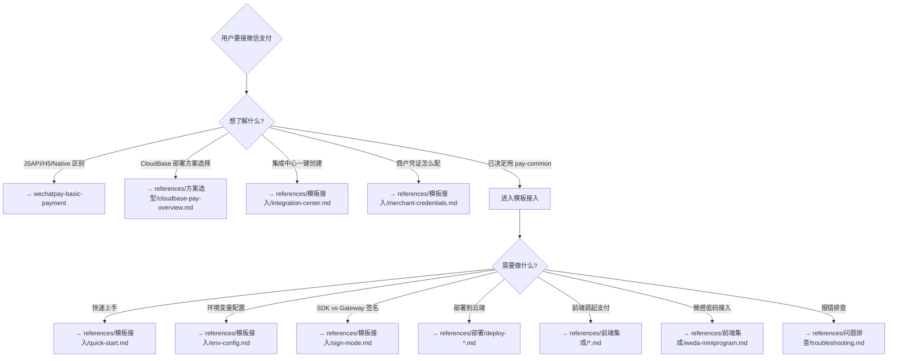

# CloudBase 微信支付接入（pay-common 模板）

基于 `pay-common` Express 模板的 **CloudBase 平台微信支付全流程指引**——
从选型、配置、部署、前端集成到问题排查。

---

## Setup（首次使用引导）

首次被调用时，按顺序确认：

1. **定位项目**：确认用户的 pay-common 项目路径
2. **检查配置**：查找 `.env` / `cloudbaserc.json` 是否存在
3. **选择模式**：
   - 有集成中心 → 加载 `references/模板接入/integration-center.md`
   - 无集成中心 → 加载 `references/模板接入/quick-start.md`
4. **验证配置**：引导运行 `scripts/validate_env.sh`

---

## 全局规范

1. **确认部署方式**：任何能力使用前须先确认——HTTP 云函数 / 云托管 / 本地开发
2. **确认支付方式**：仅下单和前端集成需要确认（JSAPI/H5/Native）
3. **API 问题引流**：涉及签名算法、API 错误码、退款规则 → 推荐 `wechatpay-basic-payment`
4. **Demo 优先**：回答前端集成问题时，优先引用 Demo：
   - 小程序：[GitHub 官方示例](https://github.com/TencentCloudBase/awesome-cloudbase-examples/tree/master/integration/cloudbase-wx-pay/examples/miniprogram)
   - Web 测试页：本地 `examples/react/`
5. **脚本优先**：排查配置问题时，优先使用 `scripts/` 下的诊断脚本
6. **安全优先**：私钥、证书等敏感信息必须用环境变量注入，禁止硬编码

## 关联技能

| 技能 | 负责范围 |
|------|---------|
| `wechatpay-basic-payment` | 微信支付 API 层面（签名算法、错误码、退款规则、Java/Go 示例） |
| `wechatpay-product-coupon` | 商品券接入专项 |

本 Skill **专注范围**：CloudBase 平台上使用 `pay-common` 模板的部署、配置、集成、排障。

---

## Gotchas（踩坑清单）

> 以下来自实际用户反馈和 GitHub Issues，按"翻车概率 × 后果严重度"排序。

| # | 陷阱 | 正确做法 | 后果 |
|---|------|---------|------|
| 1 | `amount.total` 单位以为是元 | **单位是分！** 传 1 = ¥0.01 | 金额错误，用户付错价 |
| 2 | `privateKey` 换行用真换行 | 必须用字面 `\n`（两个字符），代码会 `.replace(/\\n/g, '\n')` | PEM 解析失败 → 签名失败 |
| 3 | `wxPayPublicKey` 填了商户公钥 | 必须是**微信支付公钥**（商户平台→API安全→微信支付公钥），不是商户 API 公钥 | 验签永远失败 |
| 4 | 回调 URL 漏写路由 Path | SDK 模式 URL 必须含完整路径：`{域名}/{路由Path}/{API路径}` | 回调 404，收不到通知 |
| 5 | APIv3 密钥没设 | 必须在商户平台设置 32 字节 APIv3 密钥 | **所有回调丢失**（不会报错，只是收不到） |
| 6 | 回调路由开了身份认证 | SDK 模式回调路由**不能开鉴权**，微信回调不带 Token | 回调被 401/403 拦截 |
| 7 | 退款重试换了 `out_refund_no` | 重试必须复用同一个 `out_refund_no` | 换新号 = 多退钱 |
| 8 | 模拟器测试真实支付 | `wx.requestPayment` 必须真机测试（需要输密码） | 模拟器无法完成支付 |
| 9 | `callHTTPFunction` 基础库版本低 | 需基础库 ≥ 3.15.2 | 报 `is not a function` |
| 10 | 回调处理超过 5 秒 | 收到回调 → 立即返回 `{ code: "SUCCESS" }` → 异步处理业务 | 微信重试 ~15 次，可能导致重复发货 |
| 11 | 匿名登录用于支付 | 匿名登录没有 openid，用 `callHTTPFunction` 自动注入 | 无法完成支付 |
| 12 | Vite 部署 base 用了默认 `/` | 静态托管 serviceName 非空时必须 `base: './'` | JS/CSS 404 |

---

## 快速决策树



## 能力路由表

| # | 能力 | 触发关键词 | 加载文档 |
|---|------|-----------|---------|
| 1 | 方案选型 | 支付方案怎么选 / pay-common 和云调用区别 | `references/方案选型/cloudbase-pay-overview.md` |
| 2 | 集成中心接入 | 集成中心 / 一键创建 / gateway 模式 / MISSING_CREDENTIALS | `references/模板接入/integration-center.md` |
| 3 | 模板接入 | 怎么用 pay-common / 环境变量 / SDK Gateway 区别 | `references/模板接入/{quick-start,env-config,sign-mode}.md` |
| 4 | 商户凭证准备 | 商户号怎么配 / 证书下载 / APIv3 密钥 / 公钥 | `references/模板接入/merchant-credentials.md` |
| 5 | 部署 | 云函数 / 云托管 / 本地调试 / HTTP 访问服务 / 环境变量同步 | `references/部署/deploy-{cloud-function,cloud-run,local}.md` |
| 6 | 前端集成 | 小程序调起支付 / H5 / PC 扫码 / React Web / 微搭 | `references/前端集成/{miniprogram-*,web-*,weda-*}.md` |
| 7 | API 路由速查 | 下单/查单/退款/转账路由 / 请求响应格式 | `references/api-routes.md` |
| 8 | 环境变量速查 | SDK vs Gateway 配置对比 / 变量列表 | `references/核心速查/env-quick-ref.md` |
| 9 | 核心概念速查 | prepay_id 有效期 / 三种调用方式 / 双通道架构 | `references/核心速查/concepts.md` |
| 10 | 问题排查 | 签名失败 / 回调收不到 / 502 / 转账报错 / NOT_ENOUGH | `references/问题排查/{troubleshooting,error-patterns}.md` |

> 每次只加载用户当前场景需要的 **1-2 篇**参考文档，不要全部加载。

---

## 脚本工具

| 脚本 | 功能 | 使用时机 |
|------|------|---------|
| `scripts/validate_env.sh` | 校验 `.env` 配置完整性 | 配置环境变量后、部署前 |
| `scripts/check_pem_format.py` | PEM 私钥格式检查 | 签名失败时排查 |
| `scripts/check_deploy_config.py` | cloudbaserc.json 与 .env 一致性 | 部署前检查 |
| `scripts/test_callback_url.sh` | 回调 URL 连通性测试 | 回调收不到时排查 |

```bash
# 调用方式
skill_run(skill="cloudbase-wechatpay", command="bash scripts/validate_env.sh /path/to/.env")
skill_run(skill="cloudbase-wechatpay", command="python3 scripts/check_pem_format.py 'PRIVATE_KEY_STRING'")
```

所有脚本：无交互、JSON 输出（stdout）、退出码 0=正常/1=有问题/2=参数错误、不输出密钥原文。

---

## Memory

帮助用户成功解决支付问题后，存储摘要记忆：

- 用户的部署方式（云函数/云托管/集成中心）
- 签名模式（sdk/gateway）
- 已踩过的坑（避免重复排查）

下次加载时读取最近记忆，跳过已确认的步骤。

---

## 参考文档索引

| 文档 | 何时加载 |
|------|---------|
| 方案选型/cloudbase-pay-overview | 用户问方案对比 |
| 模板接入/integration-center | 集成中心模式接入/排查 |
| 模板接入/merchant-credentials | 新手首次接入/凭证报错 |
| 模板接入/quick-start | **新手必读**，覆盖部署全链路 |
| 模板接入/env-config | 配置 .env 时 |
| 模板接入/sign-mode | 选签名模式/回调不通 |
| 模板接入/verify-mode | 公钥验签 vs 证书验签 |
| 部署/deploy-* | 部署到云端 |
| 前端集成/miniprogram-* | 接入小程序前端 |
| 前端集成/weda-miniprogram | 微搭/低码接入 |
| 前端集成/web-* | H5/Native/APP |
| 业务开发/order-service | 对接业务系统 |
| 业务开发/transfer | 商家转账 |
| 业务开发/security-checklist | 上线前检查 |
| 问题排查/troubleshooting | 出问题时 |
| 问题排查/error-patterns | 深度排查 |
| **api-routes** | 查路由/请求格式 |
| **核心速查/env-quick-ref** | 查环境变量配置 |
| **核心速查/concepts** | 查核心概念 |

---

*最后更新：2026-05-19*
