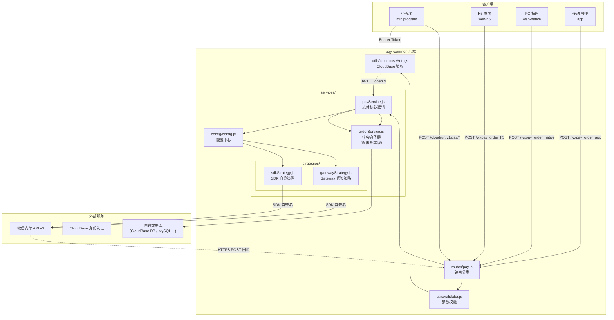
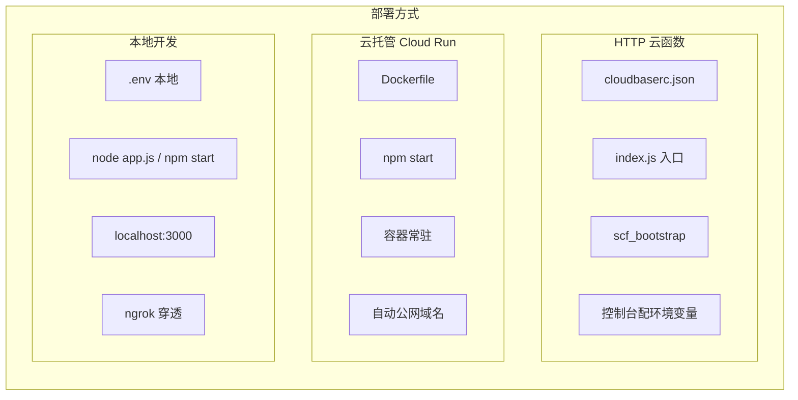
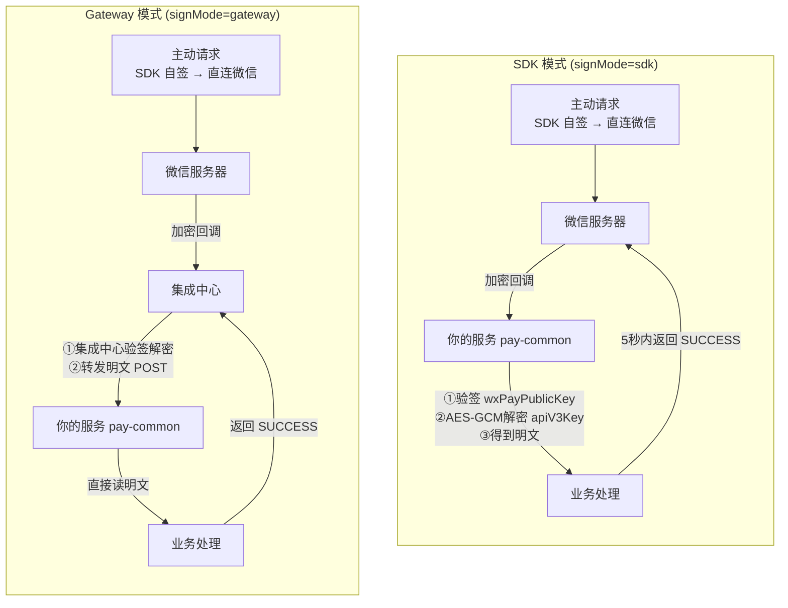

# pay-common 架构图

## 整体架构



---

## 三种部署方式



---

## 两种签名模式



**关键差异总结**：

| 维度 | SDK 模式 | Gateway 模式 |
|------|---------|-------------|
| 主动请求签名 | 相同：SDK 直连 | 相同：SDK 直连 |
| 回调接收方 | 自己的服务器 | 集成中心 |
| 谁来验签解密 | **你自己** | **集成中心** |
| 回调 URL | 自己的公网域名 | 集成中心固定域名 |
| 适用场景 | 云托管 / 自建服务器 | CloudBase 集成中心用户 |

---

## 四种支付方式前端流程

```mermaid
graph TD
    subgraph JSAPI["JSAPI 支付"]
        J1["前端传 openid"] --> J2["后端下单 /wxpay_order"]
        J2 --> J3["返回 prepay_id + 签名参数"]
        J3 --> J4["wx.requestPayment 弹窗"]
        J4 --> J5{"用户操作"}
        J5 -->|确认| J6["前端 success 回调"]
        J5 -->|取消| J7["前端 fail 回调"]
    end

    subgraph H5PAY["H5 支付"]
        H1["前端传 scene_info"] --> H2["后端下单 /wxpay_order_h5"]
        H2 --> H3["返回 h5_url"]
        H3 --> H4["跳转微信中间页"]
        H4 --> H5{"用户在微信中支付"}
        H5 --> H6["redirect_url 跳回<br/>或轮询查单确认"]
    end

    subgraph NATIVE["Native 扫码支付"]
        N1["无需 openid"] --> N2["后端下单 /wxpay_order_native"]
        N2 --> N3["返回 code_url"]
        N3 --> N4["生成二维码展示"]
        N4 --> N5["用户扫码支付"]
        N5 --> N6["每 2-3 秒轮询查单<br/>直到 SUCCESS/CLOSED/TIMEOUT"]
    end

    subgraph APAY["APP 支付"]
        A1["无需 openid"] --> A2["后端下单 /wxpay_order_app"]
        A2 --> A3["返回 APP 专用签名<br/>package=Sign+WXPay<br/>sign 非 paySign"]
        A3 --> A4["OpenSDK 发起支付"]
        A4 --> A5["微信弹窗"]
        A5 --> A6["SDK onResp 回调"]
    end
```



---

## 数据流：从下单到发货的完整链路

```
时间线 →

[前端]           [pay-common]              [微信]               [数据库]
  │                   │                       │                    │
  │ ① POST /order    │                       │                    │
  ├──────────────────→│                       │                    │
  │                   │ ② SDK 签名下单         │                    │
  │                   ├──────────────────────→│                    │
  │                   │                       │                    │
  │ ③ prepay_id      │ ④ 返回预支付ID          │                    │
  │←──────────────────┼───────────────────────┤                    │
  │                   │                       │                    │
  │ ⑤ requestPayment │                       │                    │
  │ ──────────────→(微信支付界面)                                │
  │                   │                       │                    │
  │                   │                       │ ⑥ 用户完成支付     │
  │                   │                       │                    │
  │                   │ ⑦ HTTPS POST 回调     │                    │
  │                   │←──────────────────────┤                    │
  │                   │                       │                    │
  │                   │ ⑧ 验签 + 解密          │                    │
  │                   │                       │                    │
  │                   │ ⑨ handlerUnifiedTrigger│                   │
  │                   │   ├─ 幂等检查           │                    │
  │                   │   ├─ 金额校验           │                    │
  │                   │   └─ 更新 PAID ───────→│ 写入 orders 表       │
  │                   │                       │                    │
  │                   │ ⑩ 返回 {code:SUCCESS} │                    │
  │                   ├──────────────────────→│                    │
  │                   │                       │                    │
  │ ⑪ 查单确认（可选）│                       │                    │
  ├──────────────────→│                       │                    │
  │ ←─────────────────┤                       │                    │
```

---

## 目录结构与职责

```
pay-common/
├── index.js                  SCF 入口（仅云函数部署需要）
├── scf_bootstrap            SCF 启动引导
├── app.js                   Express 应用入口
├── package.json             依赖声明
├── cloudbaserc.json          ☝ CloudBase 部署配置（仅云函数）
├── Dockerfile               ☝ 容器化配置（仅云托管）
├── .env                     环境变量（不入 Git！）
├── .env.example             环境变量模板
│
├── config/
│   └── config.js            配置加载、格式转换、校验
│
├── routes/
│   └── pay.js               18 条路由定义
│
├── services/
│   ├── payService.js        核心支付逻辑（下单/查单/退款/转账）
│   ├── orderService.js      ⭐ 业务钩子层（你实现）
│   └── strategies/
│       ├── sdkStrategy.js   SDK 自签模式实现
│       └── gatewayStrategy.js Gateway 代签模式实现
│
├── utils/
│   ├── validator.js         请求参数校验（金额/订单号等）
│   └── cloudbaseAuth.js     JWT 鉴权 + openid 提取
│
├── scripts/                 🔧 诊断脚本
│   ├── validate_env.sh
│   ├── check_pem_format.py
│   ├── check_deploy_config.py
│   └── test_callback_url.sh
│
└── examples/               📱 前端 Demo
    ├── miniprogram/         小程序-云 API 版
    ├── miniprogram-cloudrun/ 小程序-云托管版
    └── web/                 Web 测试页（JSAPI+H5+Native 三合一）
```

---

*最后更新：2026-04-24*
